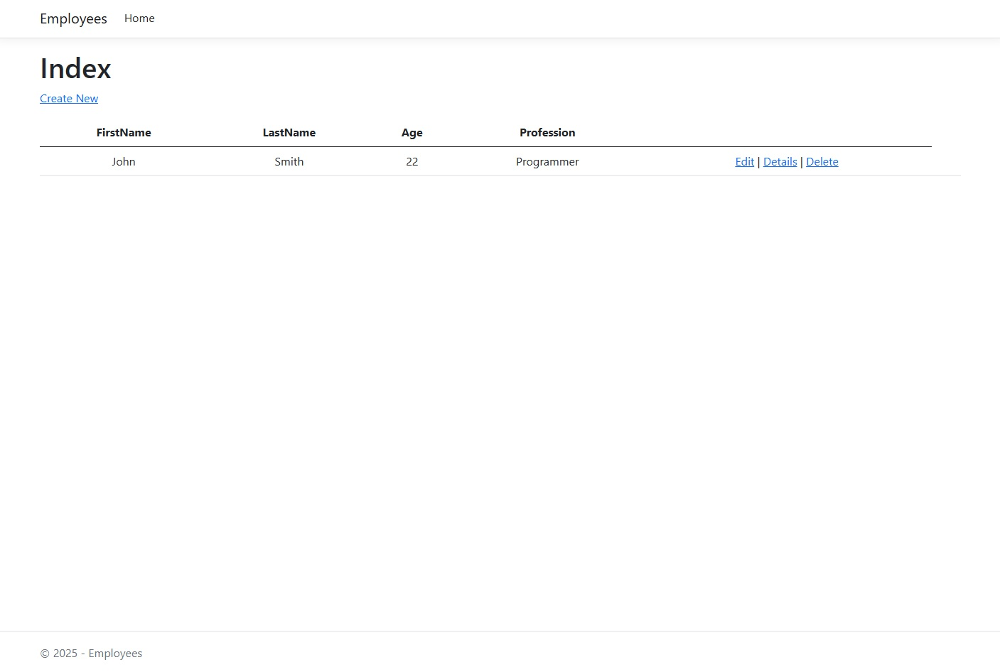
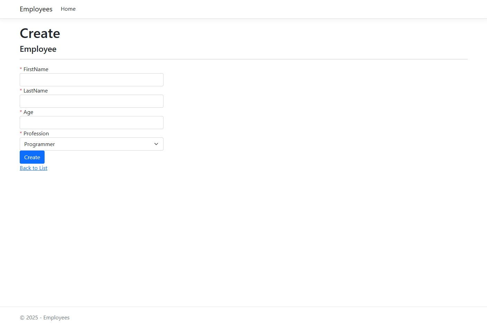
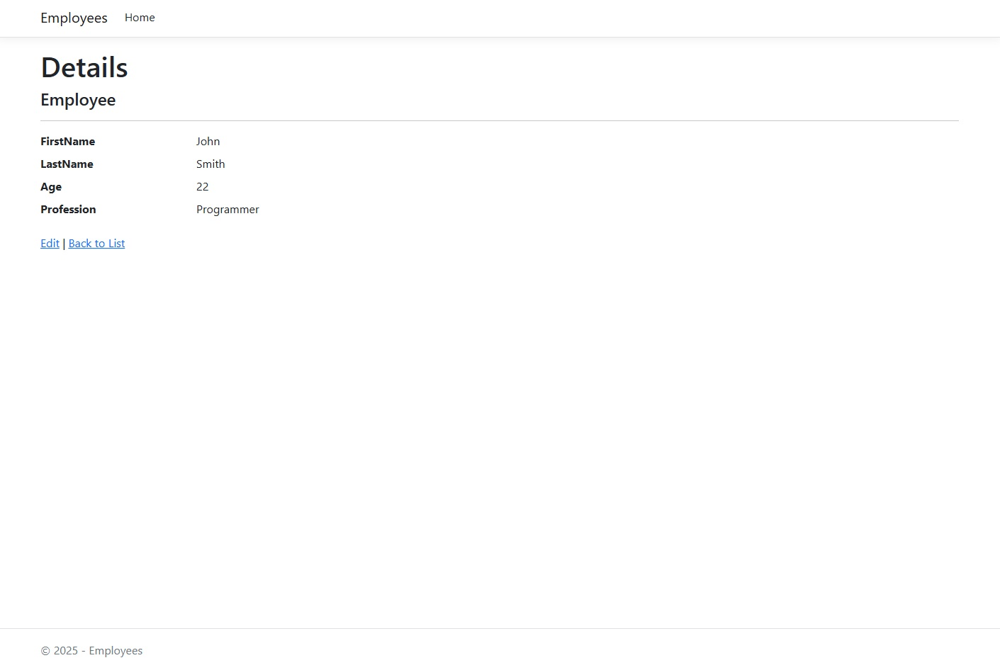
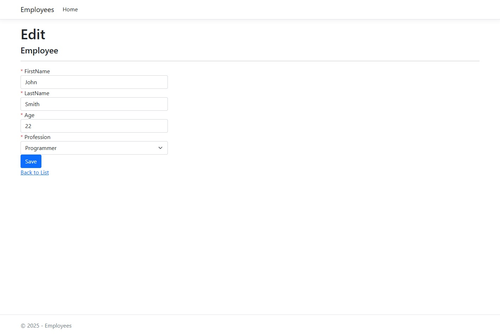
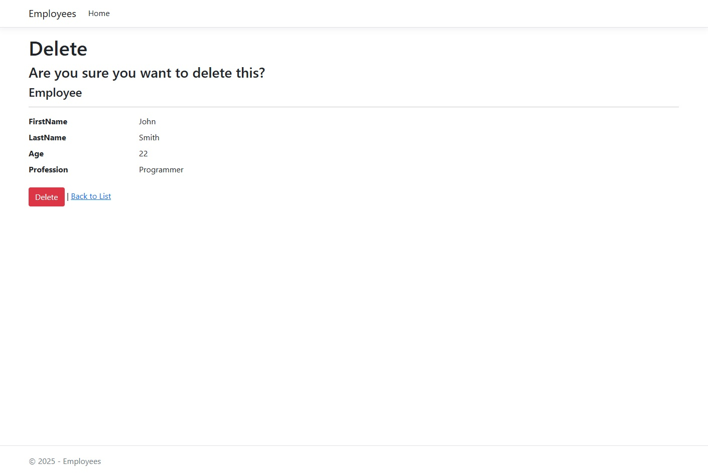

Used:
[ASP.Net](https://dotnet.microsoft.com/en-us/apps/aspnet)
[Bootstrap](https://getbootstrap.com/)
[Visual Studio](https://visualstudio.microsoft.com/)

## How to launch the app:
1. Clone the repository
2. Open the Employees.sln file in Visual Studio
3. [Open PMC](https://learn.microsoft.com/en-us/nuget/consume-packages/install-use-packages-powershell#quickly-find-and-install-a-package)
4. [Add migtation](https://learn.microsoft.com/en-us/ef/core/managing-schemas/migrations/?tabs=vs#create-your-first-migration)
5. [Update Database](https://learn.microsoft.com/en-us/ef/core/managing-schemas/migrations/?tabs=vs#create-your-database-and-schema)
6. Press Ctrl + F5
