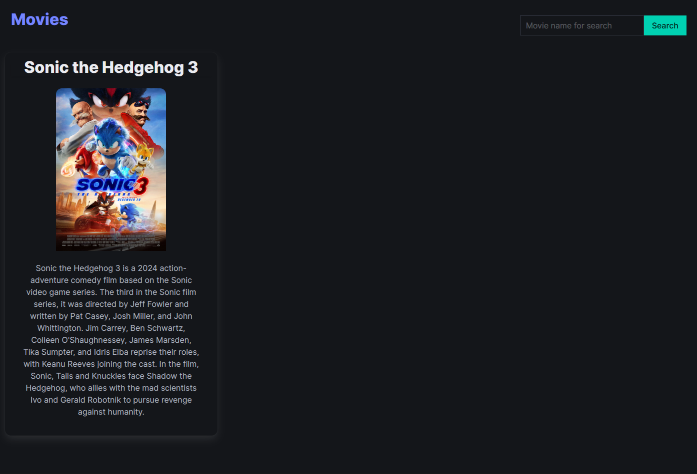
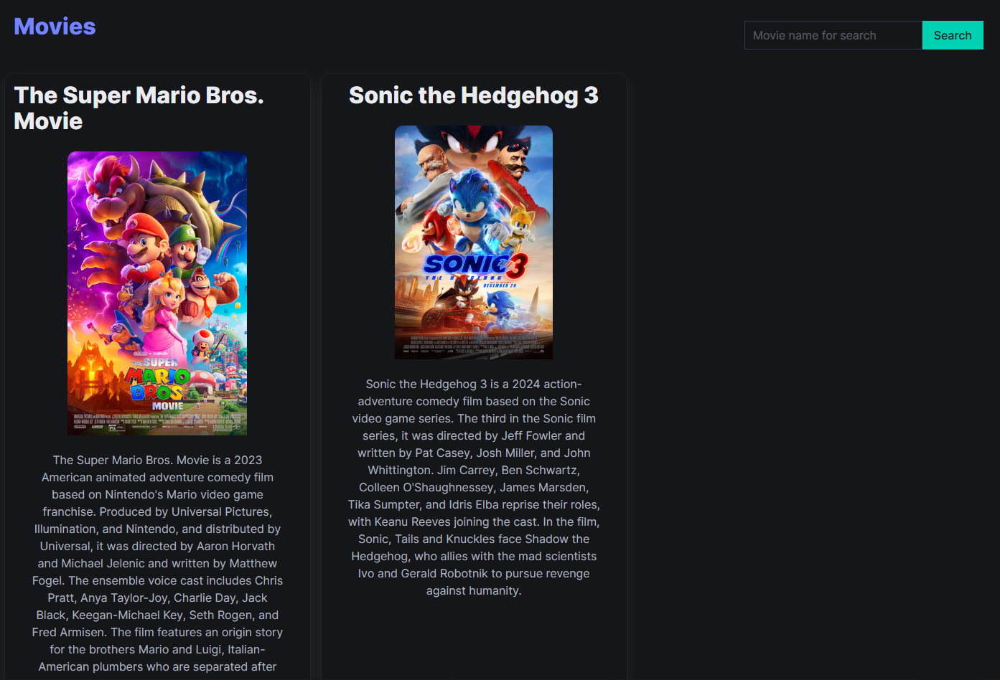

## Used: 
[PHP](https://www.php.net/)
[Bulma](https://bulma.io/)

## Get started: 
1. Clone the repo
2. Change [db.php](db.php) to your data
3. Run mysql server
4. Run PHP server

## Screenshots: 

