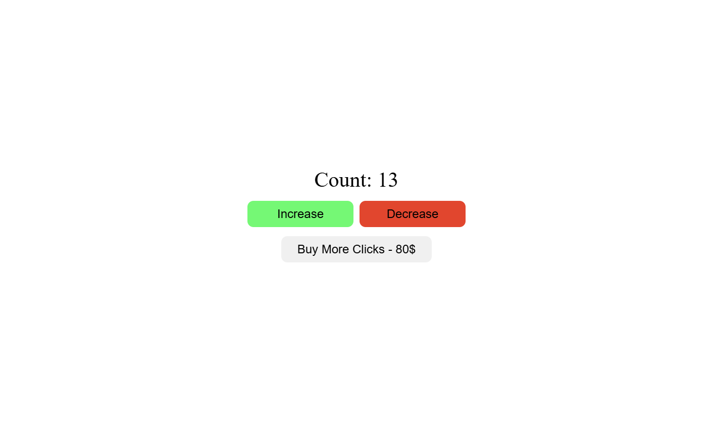

Use [pnpm](https://pnpm.io/) to get started:<br>

Used [localstorage](https://developer.mozilla.org/en-US/docs/Web/API/Window/localStorage) to save and load data.



## Project Setup

### Install dependencies

```sh
pnpm install
or
pnpm i
```

### Compile for Development

```sh
pnpm dev
```

### Compile for Production

```sh
pnpm build
```
