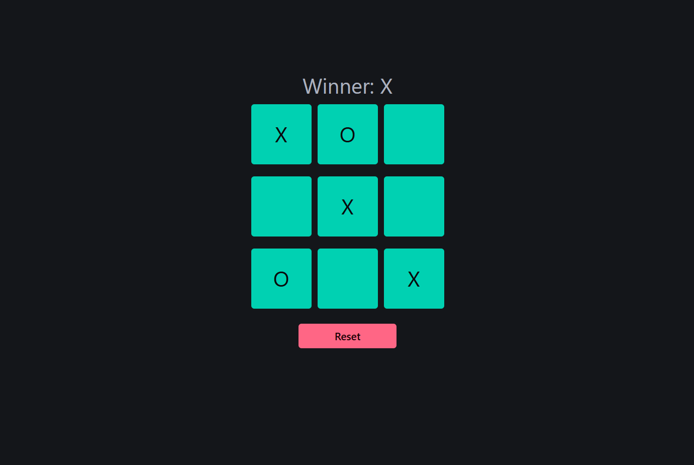

### About:
Tic tac toe game made in [React](https://react.dev/)

### How to run:
1. Clone the repo.
2. Go to the project directory.
3. Run the ```npm i```
4. Run the ```npm start```

### Screenshots


