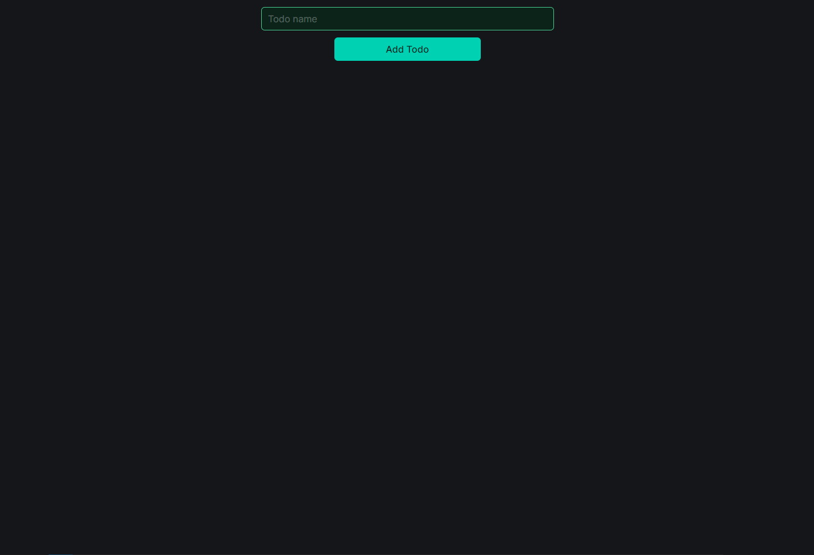
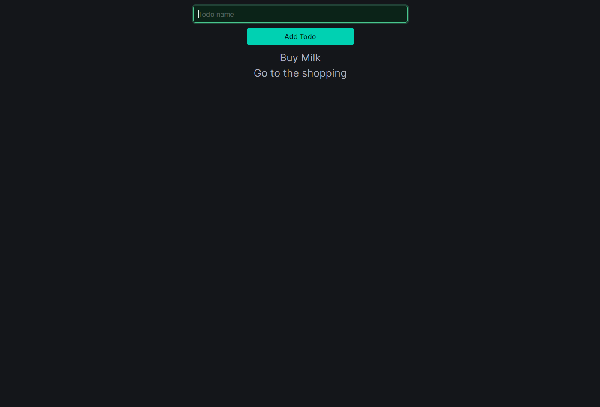

# Frameworks
[Vue](https://vuejs.org/)
[Bulma](https://bulma.io)

## Screenshots



## About project
You can:
1. Add todos
2. Remove todos (by clicking on them)

### Project Setup
```sh
npm install
```

### Compile and Hot-Reload for Development
```sh
npm run dev
```
