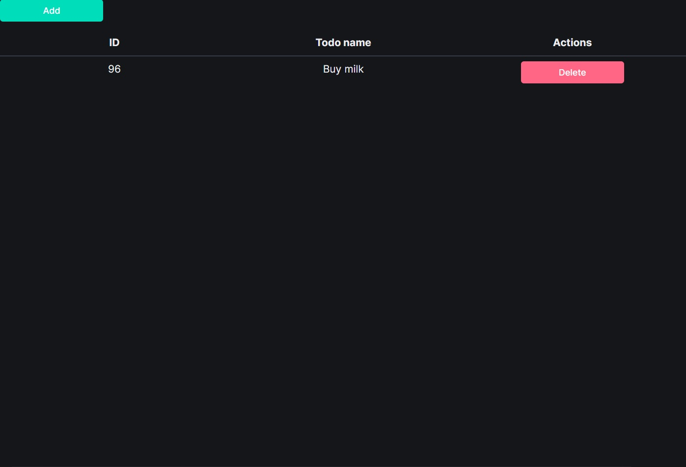
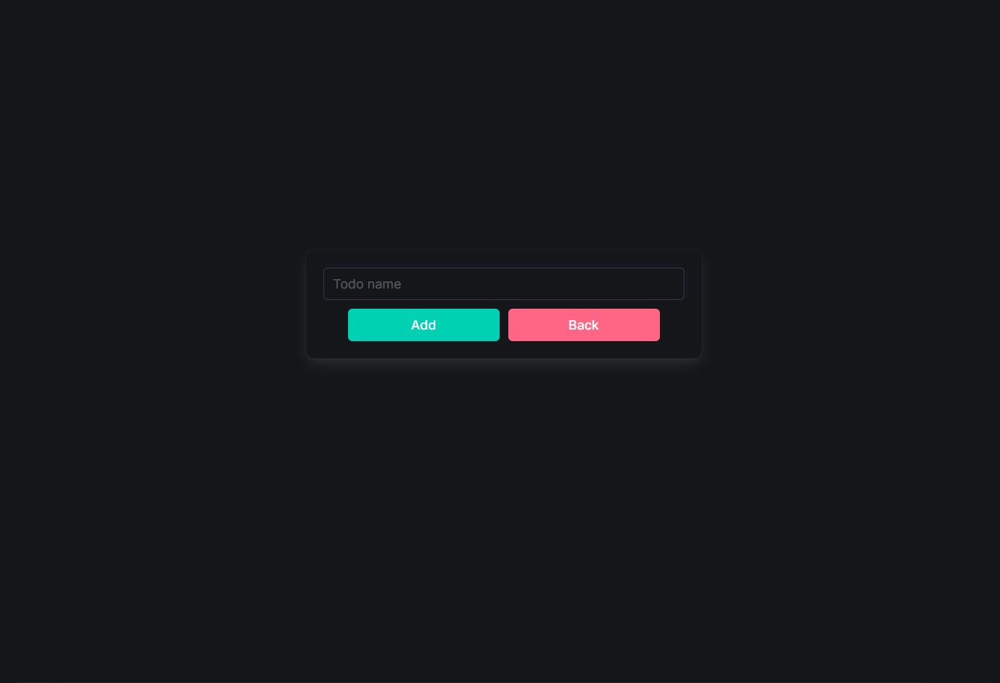

Used technologies:
[Bulma](https://bulma.io/)
[PHP](https://www.php.net/)

How to run the app:
1. Clone the repository
2. Edit sql.php to your db data
3. Run mysql server and run the todos.sql file
4. Start php server
