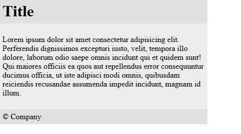

This library has only components, not a layout.

# Features:

### Buttons:

```
<div class="ui-buttons">
    <button class="ui-button ui-success">Success</button>
    <button class="ui-button ui-danger">Danger</button>
    <button class="ui-button ui-primary">Primary</button>
    <button class="ui-button ui-warning">Warning</button>
</div>
```


```
<div class="ui-buttons ui-has-addons">
    <button class="ui-button ui-success">Success</button>
    <button class="ui-button ui-danger">Danger</button>
    <button class="ui-button ui-primary">Primary</button>
    <button class="ui-button ui-warning">Warning</button>
</div>
```


### Card:

```
<div class="ui-card">
    <div class="ui-card-header">
        <h1>Title</h1>
    </div>
    <div class="ui-card-body">
        <p>Lorem ipsum dolor sit amet consecteturadipisicing elit. 
        Perferendis dignissimos excepturiiusto, velit, tempora illo dolore,
        laborum odiosaepe omnis incidunt qui et quidem sunt!
        Qui maioresofficiis ea quos aut repellendus error
        consequunturducimus officia, ut iste adipisci modi
        omnis,quibusdam reiciendis recusandae assumenda impeditincidunt,
        magnam id illum.</p>
    </div>
    <div class="ui-card-footer">
        <p>&copy; Company</p>
    </div>
</div>
```


